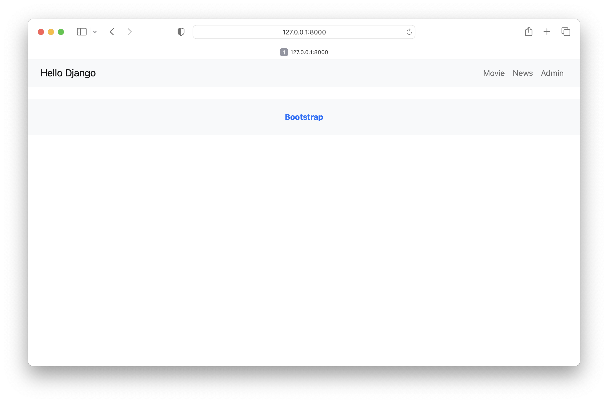

# hello_django

## このプロジェクトについて

- DjangoとBootstrapのHello World的なプロジェクトで。

## 動作確認

1. プロジェクトディレクトリ下でvenvをアクティベート
```
source movie_review_venv/bin/activate
```

2. サーバー起動
```
python3 movie_review_project/manage.py runserver
```

3. ブラウザで`http://127.0.0.1:8000/`を表示

